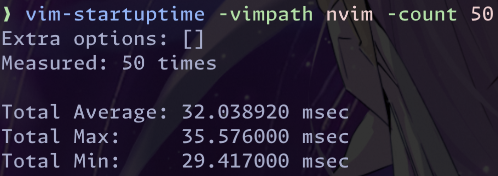

# Dotfiles


These are files that set up the dev environment on my machines, primarily the terminal. I run this on my MacBook Air M2 or on my PC with CachyOS.

## Neovim startup benchmark



## Installation

```sh
git clone git@github.com:r4zendev/dotfiles.git dotfiles && cd dotfiles && stow . -t ~`
```

## Software

- Terminal: [Ghostty](http://ghostty.org/)
- Multiplexer: [tmux](https://github.com/tmux/tmux/wiki)
- Editor: [Neovim](https://neovim.io)
- Shell: [fish](https://fishshell.com/)
- Prompt: [Starship](https://starship.rs/)
- Font: [Monaspace](https://monaspace.githubnext.com/)
- Hotkeys: [Hammerspoon](https://hammerspoon.org/)
- Git: [lazygit](https://github.com/jesseduffield/lazygit)
- Docker: [lazydocker](https://github.com/jesseduffield/lazydocker)
- Colors: [catppuccin](https://github.com/catppuccin/)
- Window manager: [yabai](https://github.com/koekeishiya/yabai)
- See [`install.sh`](bin/install.sh) for other utils used

## 🎉 Acknowledgment

Thanks to these wonderful people and repos, I was able to assemble this dotfiles repository of mine.

- [Josh Medeski](https://github.com/joshmedeski/dotfiles)
- [Josean Martinez](https://github.com/josean-dev/dev-environment-files/)
- [kickstart.nvim](https://github.com/nvim-lua/kickstart.nvim)

## Misc

- Check out [my layout of choice](https://github.com/r4zendev/glophite) that I practice with my [MoErgo Glove80](https://www.moergo.com/collections/glove80-keyboards/products/glove80-split-ergonomic-keyboard-revision-2)
- macOS might require running `defaults write org.hammerspoon.Hammerspoon MJConfigFile "~/.config/hammerspoon/init.lua"` to make hammerspoon properly inject some of the hotkeys/scripts
