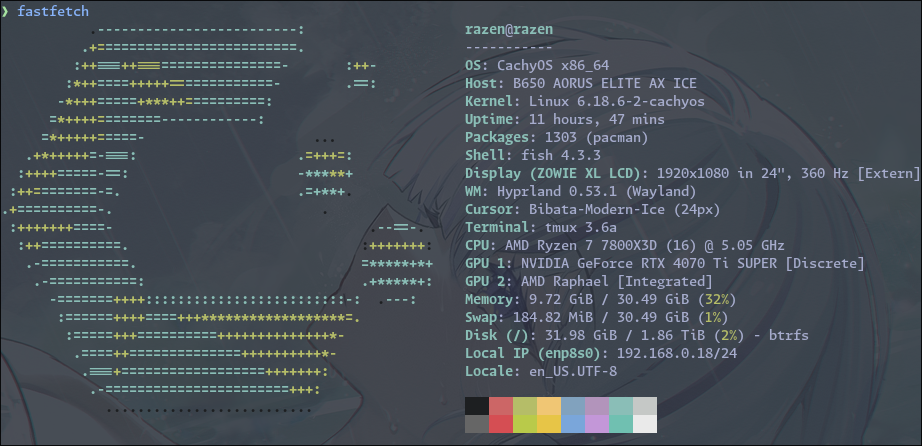

# Dotfiles




## Installation

```sh
git clone git@github.com:r4zendev/dotfiles.git dotfiles
cd dotfiles/stow
stow -t ~ common
stow -t ~ darwin   # macOS
stow -t ~ linux    # Arch/CachyOS
```

## Main tools

- Keyboard: [MoErgo Glove80](https://www.moergo.com/collections/glove80-keyboards/products/glove80-split-ergonomic-keyboard-revision-2) with [Graphite-based layers](https://github.com/r4zendev/glophite)
- Terminal: [Ghostty](http://ghostty.org/)
- Editor: [Neovim](https://neovim.io)
- Multiplexer: [tmux](https://github.com/tmux/tmux/wiki)
- Shell: [fish](https://fishshell.com/)
- Prompt: [Starship](https://starship.rs/)
- Font: [Monaspace](https://monaspace.githubnext.com/)
- Arch Linux
  - OS: [CachyOS](https://cachyos.org/)
  - DE/WM: [Hyprland](https://hypr.land/)
- Darwin
  - Hotkeys: [Hammerspoon](https://hammerspoon.org/)
  - WM: [yabai](https://github.com/koekeishiya/yabai)
