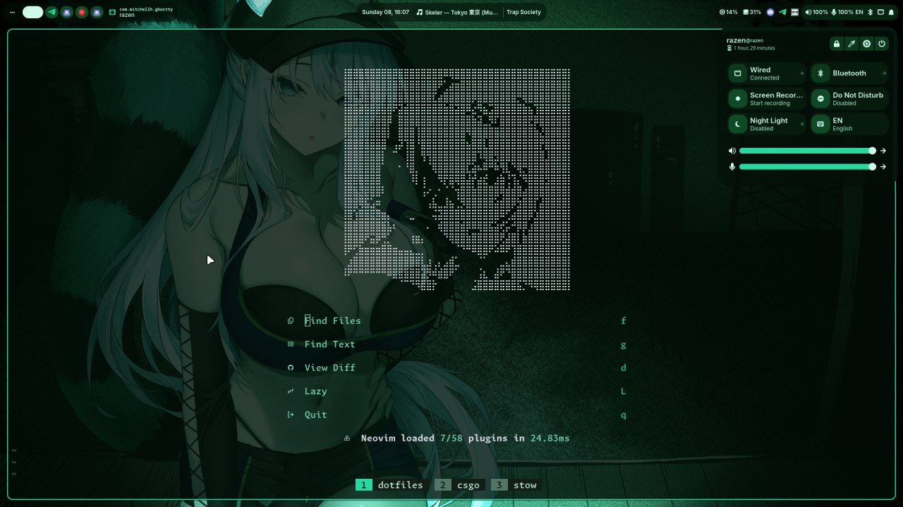
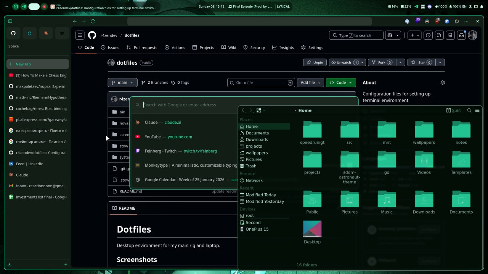
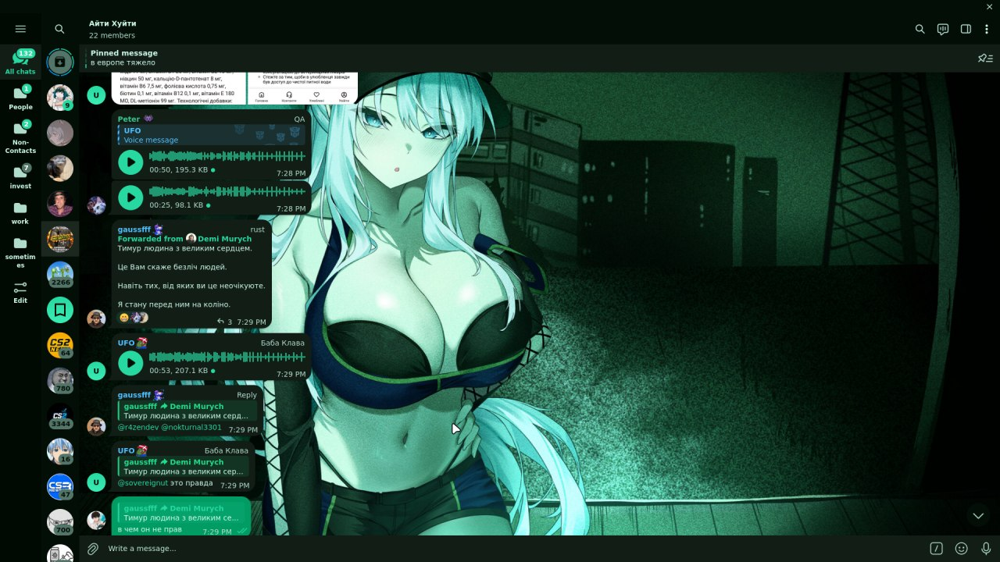
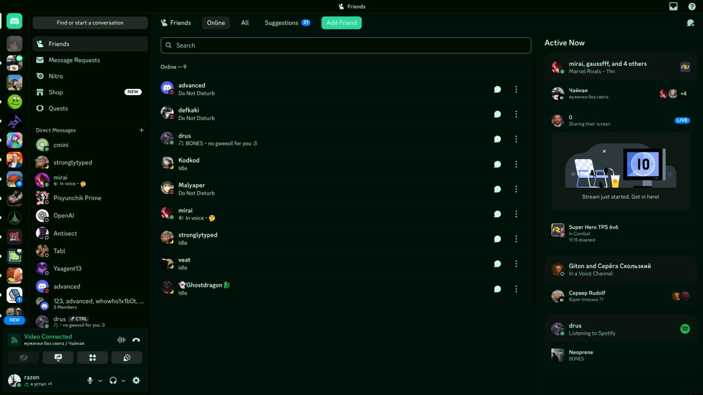
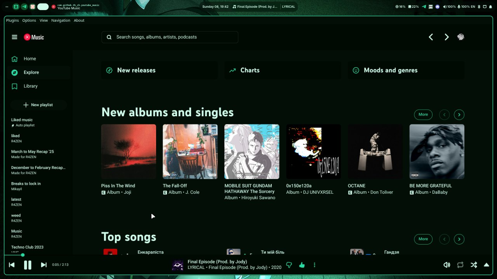

# Dotfiles

Desktop environment for my main rig and laptop.

## Screenshots

| Terminal                                | Neovim                                    | Desktop                                        |
| --------------------------------------- | ----------------------------------------- | ---------------------------------------------- |
|  |  |  |

| Telegram                                | Discord                               | YT Music Desktop                             |
| --------------------------------------- | ------------------------------------- | -------------------------------------------- |
|  |  |  |

## Tooling

| Layer          | Tooling                                                              |
| -------------- | -------------------------------------------------------------------- |
| OS / WM        | CachyOS (Arch) + Hyprland                                            |
| OS Shell       | [Novashell](./novashell) (AGS + Astal)                               |
| Terminal       | Ghostty + tmux + fzf                                                 |
| Terminal Shell | Fish + Starship + Zoxide                                             |
| Editor         | Neovim                                                               |
| Keyboard       | [Custom-built 34 keys alt layout](https://github.com/r4zendev/keebs) |

## Custom features

- Unified shell windows: bar, control center, runner, notification centre, media controls, etc.
- Live custom theme generation based on wallpaper colors. 10+ apps synced on the fly as well as all kinds of icons.
- Utilities integrations (Mission Center, btop, Google Calendar, and more)
- Predictable interface interactions (e.g. notifications, media controls, etc.)
- `nsh` and `nsh-msg` (fast socket version) for system-specific actions (windows, media, volume, themes, wallpapers, etc.).
- Runner plugins for apps, shell commands, web search, clipboard, wallpapers, media, themes, and even color conversion.
- Fish shell with custom helper functions (5+ useful custom fzf pickers and other system utilities).
- Tmux setup with custom pickers, persistence (restore/continuum) and utility-overlays (e.g. lazygit, lazydocker, dblab, etc.).
- Highly performant Neovim setup with 50+ plugins and a lot of custom functionality tailored to my workflow. Search-first flow, heavy `snacks.nvim` reliance, AI integration via `codecompanion.nvim` (agentic w/ MCP) & `llama.cpp` (local-first completion).

## Repository layout

| Path        | Purpose                   |
| ----------- | ------------------------- |
| `stow`      | Home directory configs    |
| `novashell` | Novashell source code     |
| `bin`       | Install/bootstrap scripts |

## Install

### Apply dotfiles to an existing Linux machine

```sh
git clone git@github.com:r4zendev/dotfiles.git ~/projects/dotfiles
cd ~/projects/dotfiles/stow
stow -t ~ common
stow -t ~ linux
```

### Full Linux bootstrap (packages + Novashell build)

```sh
~/projects/dotfiles/bin/install-arch.sh
```

## macOS (secondary)

macOS support exists via `stow/darwin` and `bin/install.sh` (yabai + hammerspoon) for my laptop, but it's not actively supported anymore.
