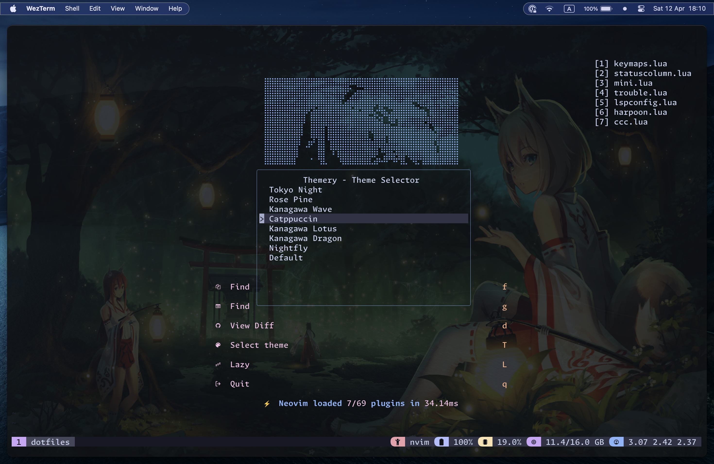
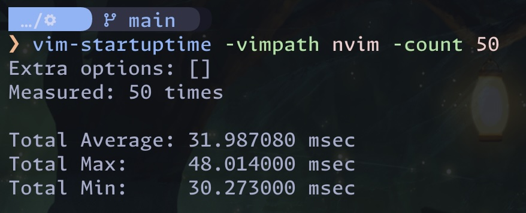

# Dotfiles



These are files that add custom configurations to my computer and applications, primarily the terminal.

## Neovim startup benchmark



## Installation

My dotfiles are managed by [GNU Stow](https://www.gnu.org/software/stow/).

1. Install [homebrew](https://brew.sh/)
2. Install [GNU Stow](https://www.gnu.org/software/stow/) (`brew install stow`)
3. Clone this repository
4. Run `defaults write org.hammerspoon.Hammerspoon MJConfigFile "~/.config/hammerspoon/init.lua"`
5. Run stow command

```sh
stow . -t ~
```

## Software

- Terminal: [WezTerm](https://wezterm.org/)
- Multiplexer: [tmux](https://github.com/tmux/tmux/wiki)
- Shell: [fish](https://fishshell.com/)
- Prompt: [Starship](https://starship.rs/)
- Editor: [Neovim](https://neovim.io)
- Git: [lazygit](https://github.com/jesseduffield/lazygit)
- Docker: [lazydocker](https://github.com/jesseduffield/lazydocker)
- Font: [Monaspace](https://monaspace.githubnext.com/)
- Colors: [catppuccin](https://github.com/catppuccin/)
- Hotkeys: [Hammerspoon](https://hammerspoon.org/)
- Window manager: [yabai](https://github.com/koekeishiya/yabai)
- See [`install.sh`](bin/install.sh) for other utils used

## Hardware

- Laptop: 13-inch MacBook Air, Apple M2 Chip, 16GB RAM, Late 2022
- During free time, I practice my [MoErgo Glove80](https://www.moergo.com/collections/glove80-keyboards/products/glove80-split-ergonomic-keyboard-revision-2) and [Piantor Pro](https://shop.beekeeb.com/product/pre-soldered-piantor-split-keyboard/) with [my own layout](https://github.com/r4zendev/glophite) based on Graphite keyboard layout

## Future

- [ ] Try out [vtsls](https://github.com/yioneko/vtsls) for TypeScript-based projects
- [ ] Improve [DAP](.config/nvim/lua/r4zen/plugins/dap.lua), [Neotest](.config/nvim/lua/r4zen/plugins/neotest.lua) & [yarepl](.config/nvim/lua/r4zen/plugins/yarepl.lua)+Aider usage/workflows
- [ ] Try out [AeroSpace](https://github.com/nikitabobko/AeroSpace) (currently happy with [`yabai`](https://github.com/koekeishiya/yabai))
- [ ] Build the same kind of configuration for my CachyOS (Arch-based) rig using Hyprland/AutoHotkey etc.

## 🎉 Acknowledgment

Thanks to these wonderful people and repos, I was able to assemble this dotfiles repository of mine.

- [Josh Medeski](https://github.com/joshmedeski/dotfiles)
- [Josean Martinez](https://github.com/josean-dev/dev-environment-files/)
- [kickstart.nvim](https://github.com/nvim-lua/kickstart.nvim)
